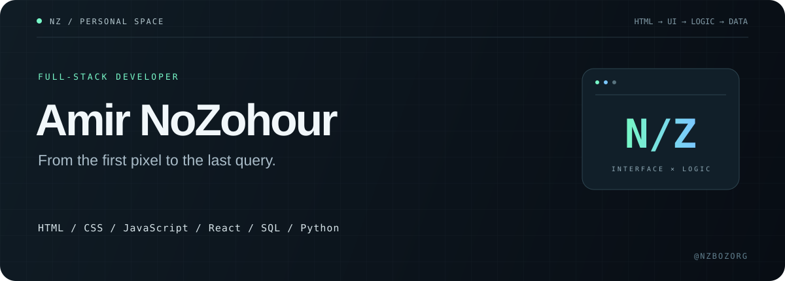

<p align="center">
  
</p>

<p align="center">
  <a href="https://github.com/nzbozorg">GitHub</a> &nbsp; / &nbsp;
  <a href="https://t.me/nzornot">Telegram</a> &nbsp; / &nbsp;
  <a href="https://instagram.com/nzbozorg">Instagram</a> &nbsp; / &nbsp;
  <a href="https://coffeebede.com/Amir_NoZohour">Buy me a coffee ↗</a>
</p>

<br />

## 01 / Behind the code

### Hey, I'm 𝑨𝒎𝒊𝒓 𝑵𝒐𝒁𝒐𝒉𝒐𝒖𝒓.

A **full-stack developer** connecting what people see with what makes it work.

My toolkit spans **HTML, CSS, JavaScript, React, Python, and SQL** — from structuring a page and building its interactions to writing application logic and working with data.

**The interface is only half the story. I like building the other half, too.**

<br />

## 02 / My development palette

| Layer | My tools | Where they fit |
| :--- | :--- | :--- |
| **Structure & style** | `HTML` · `CSS` | Page structure, layouts, and visual details |
| **Interaction & UI** | `JavaScript` · `React` | Interactive experiences and component-based interfaces |
| **Application logic** | `Python` | Backend logic, scripting, and automation |
| **Data** | `SQL` | Querying, organizing, and connecting information |

```text
                  THE PART YOU SEE          THE PART THAT POWERS IT
                 ┌─────────────────┐        ┌─────────────────┐
                 │ HTML · CSS      │        │ Python          │
                 │ JavaScript      │  ←──→  │ SQL             │
                 │ React           │        │ Logic + Data    │
                 └─────────────────┘        └─────────────────┘
                            One developer. Both sides.
```

<br />

## 03 / Around the internet

Different places. Same Amir.

| Find me | What's on the other side |
| :--- | :--- |
| **[GitHub ↗](https://github.com/nzbozorg)** | Explore my repositories and code |
| **[Telegram ↗](https://t.me/nzornot)** | Start a conversation |
| **[Instagram ↗](https://instagram.com/nzbozorg)** | Connect beyond the code |

Have a project idea or something interesting to share? **[Say hello on Telegram →](https://t.me/nzornot)**

<br />

## 04 / A little fuel for the next build

If you find something useful in my work, you can support me with a coffee. No pressure — taking a look at my projects already means a lot.

**[☕ Buy me a coffee on Coffeebede →](https://coffeebede.com/Amir_NoZohour)**

<br />

---

<p align="center">
  <strong>Pixels. Logic. Data.</strong><br />
  <sub>Three parts of the same story — built by Amir NoZohour.</sub>
</p>
